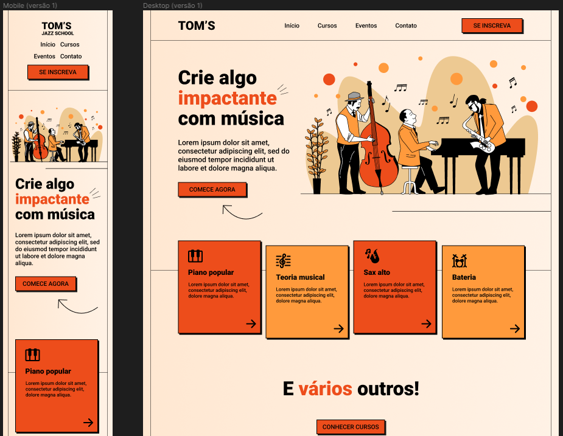

<h1 align="center"> Projeto Landing Page - Tom's Jazz School </h1>

Atividade desenvolvida através de aulas gratuitas disponibilizadas pela Onebitcode.  

  <a href="#-tecnologias">Tecnologias</a>&nbsp;&nbsp;&nbsp;|&nbsp;&nbsp;&nbsp;
  <a href="#-projeto">Projeto</a>&nbsp;&nbsp;&nbsp;

 

  

## 🚀 Tecnologias

Esse projeto foi desenvolvido com as seguintes tecnologias:

- Figma
- HTML
- CSS
- JavaScript
- Git e Github

## 💻 Projeto

Projeto para desenvolvimento de landing page para divulgação de escola de música fictícia. Desenvolvido com os princípios de responsividade em foco, sendo possível acessar na versão desktop e mobile.